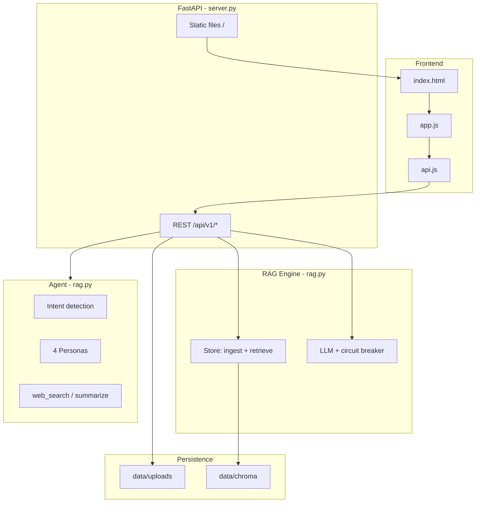
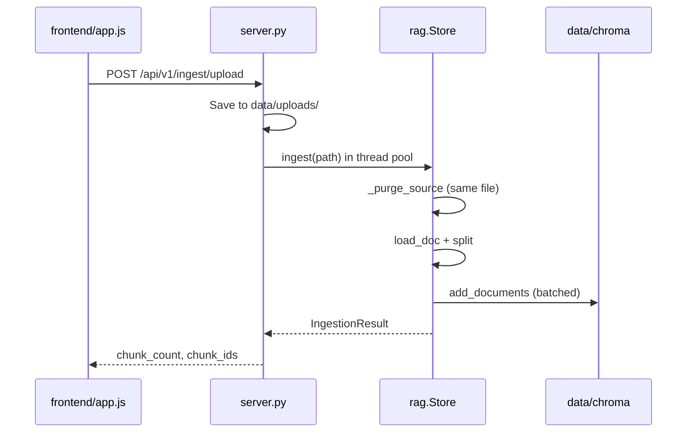
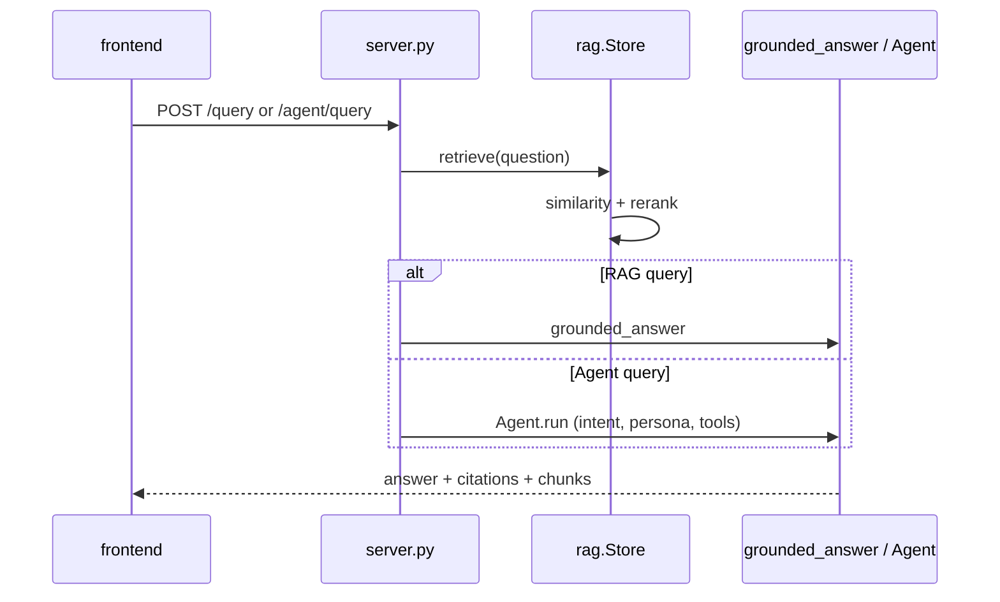

# Multi-Persona Content Hub — Structure & Blueprint

**Version:** 0.3.0 | **Entry:** [scripts/run.ps1](../scripts/run.ps1) → `http://127.0.0.1:8001`

The project is a **consolidated monolith**: Phase 1 (RAG) and Phase 2 (multi-persona agent) live in a small set of Python modules plus a static frontend. Earlier modular folders (`app/ingestion/`, `app/chunking/`, etc.) were merged into [app/rag.py](../app/rag.py).

---

## Directory Tree

```
multi_persona_content_hub/
├── .env / .env.example          # Runtime config (API keys, chunk sizes, LLM)
├── requirements.txt             # Python dependencies
├── main.py                      # Alternate uvicorn entry (port 8001)
│
├── app/                         # Backend (FastAPI + RAG + Agent)
│   ├── __init__.py              # __version__ = "0.3.0"
│   ├── config.py                # Settings from .env (paths, models, thresholds)
│   ├── models.py                # Pydantic request/response & domain types
│   ├── rag.py                   # Core engine (~900 lines): ingest, retrieve, LLM, personas, Agent
│   └── server.py                # HTTP routes, static UI mount, lifespan
│
├── frontend/                    # Single-page UI (served by FastAPI)
│   ├── index.html               # Shell: Dashboard, Documents, RAG, Agent views
│   ├── styles.css               # Blue + white theme
│   ├── api.js                   # fetch wrapper → /api/v1/*
│   └── app.js                   # UI logic, upload, health, query, agent
│
├── scripts/
│   ├── run.ps1                  # Kill port 8001, start uvicorn
│   ├── smoke_test.py            # CLI: ingest sample + grounded query
│   ├── agent_smoke_test.py      # CLI: persona agent query
│   ├── convert_report_to_docx.py
│   └── convert-report.ps1
│
└── data/                        # Runtime persistence (gitignored in practice)
    ├── uploads/                 # Uploaded PDFs/TXT (e.g. AI.pdf)
    ├── samples/sample.txt       # Bundled test document
    ├── chroma/                  # ChromaDB vector index (chroma.sqlite3)
    ├── sessions/                # Legacy session JSON (from earlier phases)
    └── evaluations/             # Legacy evaluation JSON
```

---

## Layered Architecture



---

## Backend Modules (what each file owns)

### [app/config.py](../app/config.py) — Configuration

- `Settings` (Pydantic): paths, embedding model, chunking, retrieval `top_k` / `similarity_threshold`, LLM provider (Gemini or OpenRouter), feature flags.
- `get_settings()` creates `data/`, `data/uploads/`, `data/chroma/` on load.

### [app/models.py](../app/models.py) — API contracts

| Type | Purpose |
|------|---------|
| `ChunkRecord`, `IngestionResult` | Ingest pipeline |
| `RetrievedChunk`, `QueryResult` | RAG query |
| `PersonaDefinition`, `IntentType` | Agent personas |
| `AgentWorkflowResult` | Agent response |
| `HealthResponse`, `QueryRequest`, `AgentQueryRequest`, etc. | HTTP schemas |

### [app/rag.py](../app/rag.py) — Core engine (single file, logical sections)

| Section | Key symbols | Responsibility |
|---------|-------------|----------------|
| **LLM** | `get_llm`, `chat`, `llm_auth_status`, `circuit_open` | OpenRouter/Gemini; auth check; failure circuit breaker |
| **Grounded Q&A** | `grounded_answer`, `Citations`, `_extractive_structured_answer` | Answer from retrieved chunks only; refuse if unsupported |
| **Ingest** | `load_doc`, `Store.ingest`, `_purge_source` | PDF/TXT → split → embed → Chroma; re-upload purges same source |
| **Retrieve** | `Store.retrieve`, `_rerank` | Similarity search + keyword re-rank + threshold fallback |
| **Personas** | `PERSONAS`, `PERSONA_RULES`, `INTENT_RULES`, `INTENT_PERSONA` | 4 personas: technical_writer, educator, social_media_manager, research_analyst |
| **Agent** | `Agent.run`, `_intent`, `_parse_orchestrator_command`, `_tools` | Intent → persona → optional tools → RAG → styled answer |

**Singleton:** `get_store()` holds one `Store` (embeddings + Chroma) for the process lifetime.

### [app/server.py](../app/server.py) — HTTP surface

| Method | Route | Handler |
|--------|-------|---------|
| GET | `/api/v1/health` | Status, chunk count, LLM mode |
| POST | `/api/v1/ingest/upload` | Multipart file upload → `Store.ingest` |
| POST | `/api/v1/ingest/path` | Ingest local path (dev) |
| DELETE | `/api/v1/index` | Clear all Chroma chunks |
| POST | `/api/v1/query` | RAG-only grounded answer |
| GET | `/api/v1/agent/personas` | List personas |
| POST | `/api/v1/agent/query` | Persona agent workflow |
| GET | `/` | [frontend/index.html](../frontend/index.html) |
| GET | `/styles.css`, `/api.js`, `/app.js` | Static assets |

**Lifespan:** On startup, `warm_store()` loads the embedding model and logs chunk count.

---

## Frontend Blueprint

### [frontend/api.js](../frontend/api.js)

- Resolves API base: input field → `localStorage` → `window.location.origin` → `http://127.0.0.1:8001`.
- `request()` wraps `fetch` with JSON error parsing.
- Exports: `health`, `ingestUpload`, `clearIndex`, `query`, `listPersonas`, `agentQuery`.

### [frontend/app.js](../frontend/app.js)

- **Views:** Dashboard (health), Documents (upload + clear index), RAG (query), Agent (persona + query).
- **Upload flow:** `uploadFile()` → `Api.ingestUpload()` → progress UI → `refreshHealth()`.
- **Persona switcher:** global dropdown feeds agent queries.

### [frontend/index.html](../frontend/index.html) + [styles.css](../frontend/styles.css)

- Single-page shell with nav pills and four content panels.
- Monochrome blue accent theme.

---

## Data Flow Diagrams

### Ingest pipeline



### Query / Agent pipeline



---

## External Dependencies (from [requirements.txt](../requirements.txt))

| Layer | Libraries |
|-------|-----------|
| API | FastAPI, uvicorn |
| RAG | langchain, langchain-community, langchain-text-splitters, chromadb |
| Embeddings | sentence-transformers (`all-MiniLM-L6-v2`) |
| PDF | pypdf |
| LLM | langchain-openai (OpenRouter-compatible), langchain-google-genai |
| Config | pydantic-settings |
| Agent tools | duckduckgo-search |

---

## Configuration Knobs (.env)

Key settings in [app/config.py](../app/config.py):

- **Paths:** `data/uploads`, `data/chroma`
- **Chunking:** `CHUNK_SIZE=1400`, `CHUNK_OVERLAP=120`, `INGEST_BATCH_SIZE=128`
- **Retrieval:** `TOP_K=6`, `AGENT_TOP_K=8`, `SIMILARITY_THRESHOLD=0.2`
- **LLM:** `LLM_PROVIDER`, `OPENROUTER_API_KEY` or `GEMINI_API_KEY`, `LLM_MODEL`, `ENABLE_LLM`

See [.env.example](../.env.example) for a full template.

---

## Scripts & How to Run

| Script | Purpose |
|--------|---------|
| [scripts/run.ps1](../scripts/run.ps1) | Production-style start on port **8001** |
| [main.py](../main.py) | `python main.py` alternative |
| [scripts/smoke_test.py](../scripts/smoke_test.py) | End-to-end ingest + query without UI |
| [scripts/agent_smoke_test.py](../scripts/agent_smoke_test.py) | Persona agent smoke test |

---

## Design Notes (current state)

1. **Consolidated vs modular:** All RAG/agent logic is in one file ([rag.py](../app/rag.py)) for simplicity; types and config are split out.
2. **Blocking ingest:** Large PDF embedding runs in `asyncio.to_thread` — UI may wait minutes; no client-side timeout in [api.js](../frontend/api.js).
3. **Mixed chunk IDs in index:** Older ingests used path-based IDs (`C_/multi_persona...#chunk_0`); newer code uses `filename#index`. Re-upload relies on `_purge_source` by `source` path.
4. **LLM fallback:** Invalid API key → extractive answers still work from retrieved chunks.

---

## Quick Reference: File → Responsibility

```
config.py     → WHAT to configure
models.py     → WHAT shapes cross the wire
rag.py        → HOW documents are indexed, retrieved, and answered
server.py     → WHO can call it (HTTP)
frontend/*    → WHERE users interact
data/*        → WHERE state lives
scripts/*     → HOW to run and test
```
